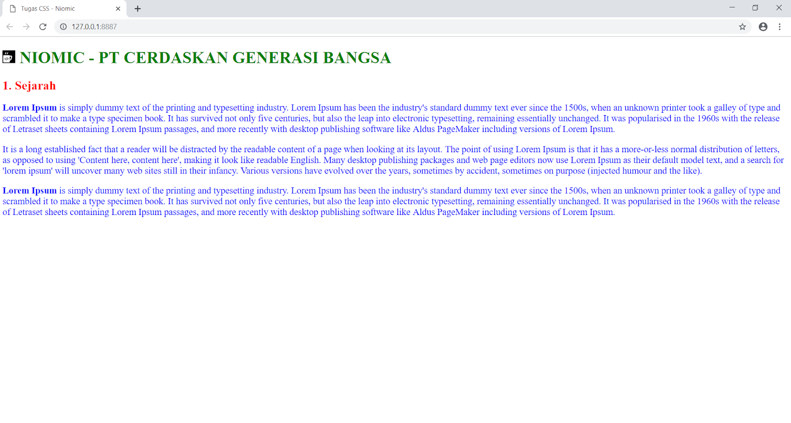

# TUGAS 1 CSS
### Membuat Komentar, Media Type, Inline CSS, Internal CSS, & External CSS
Buatlah sebuah file html menggunakan desain CSS sehingga menampilkan seperti berikut :
  
Dengan ketentuan :  
1. Buatlah Judul (teks warna hijau) menggunakan elemen HTML Heading 1  
2. Buatlah Sub Judul (teks warna merah) menggunakan elemen HTML Heading 2  
3. Buatlah Deskripsi (teks warna biru) menggunakan elemen HTML Paragraf  
4. Buatlah Komentar pada Internal CSS yang mendeskripsikan “Apa Itu CSS” menurut anda  
5. Gunakan Media Type berjenis Screen pada External CSS  
6. Gunakan Inline CSS (dengan setting warna merah) pada Heading 2  
7. Gunakan Internal CSS (dengan setting warna hijau) pada Heading 1  
8. Gunakan External CSS (dengan setting font 18 pixel dan warna biru) pada Paragraf  
9. Link logo Niomic : <https://drive.google.com/open?id=1GNC0c0RVGZtq5BQ_CarPLbIyxZoK46nF>
10. Link Text dummy (Lorem Ipsum) : <https://www.lipsum.com/>  
